# React Just Datepicker

Got tired of struggling with browser's default input datepicker? Demotivated by poor documentation and limited customisation features provided by myriad of react modules? Do you need just a datepicker for your project?  
`React Just Datepicker` is here for you!

It's a datepicker that was designed to be simple, flexible and a full replacement to default date inputs. Have a look at it [here](https://fqqvy.csb.app/).

_Note: this component works as expected within date range from 01.01.1000 till 31.12.3999._

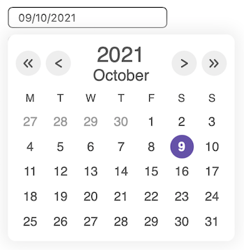

## Contents

[**Installation**](#installation)

[**Usage**](#usage)

[**Functional properties**](#func-props)

* [name](#name)
* [value](#value)
* [handleDateChange](#handleDateChange)
* [handleBlur](#handleBlur)
* [placeholder](#placeholder)
* [locale](#locale)
  * [dateFormat](#dateFormat)
  * [startSunday](#startSunday)
  * [months](#months)
  * [addMonths](#addMonths)
  * [showWeekDays](#showWeekDays)
  * [weekDays](#weekDays)
  * [addWeekDays](#addWeekDays)

[**Styling properties**](#style-props)

* [styleChanges](#styleChanges)
    * [pickerContainerClass](#pickerContainerClass)
    * [inputClass](#inputClass)
    * [calendarContainerClass](#calendarContainerClass)
    * [mainColor](#mainColor)
    * [inputBgColor](#inputBgColor);
    * [inputBorderColor](#inputBorderColor);
    * [inputBorderFocusColor](#inputBorderFocusColor);
    * [inputPlaceholderColor](#inputPlaceholderColor);
    * [inputFontColor](#inputFontColor);
    * [calendarContainerBgColor](#calendarContainerBgColor)
    * [calendarContainerShadow](#calendarContainerShadow)
    * [arrowBtnContainerClass](#arrowBtnContainerClass)
    * [arrowBtnBgColor](#arrowBtnBgColor)
    * [arrowColor](#arrowColor)
    * [yearFontColor](#yearFontColor)
    * [monthFontColor](#monthFontColor)
    * [weekDaysFontColor](#weekDaysFontColor)
    * [dateBgColor](#dateBgColor)
    * [clickedDateFontColor](#clickedDateFontColor)
    * [selectedDateFontColor](#selectedDateFontColor)
    * [selectedDateBgColor](#selectedDateBgColor)
    * [currMonthDateFontColor](#currMonthDateFontColor)
    * [prevNextMonthsDateFontColor](#prevNextMonthsDateFontColor)
    * [yearBackArrow](#yearBackArrow)
    * [yearNextArrow](#yearNextArrow)
    * [monthBackArrow](#monthBackArrow)
    * [monthNextArrow](#monthNextArrow).

## Installation <a id="installation" />

```bash
npm i react-just-datepicker
```

## Usage <a id="usage" />

Here is an example of basic Datepicker usage in React:

```jsx
import React, { useState } from 'react';
import DatePicker from 'react-just-datepicker';

function DateContainer() {
  const [date, setDate] = useState();

  return (
    <DatePicker
      value={date}
      handleDateChange={e => setDate(e.target.value)}
    />
  )
}
```

Most likely you will need more functionality and add some styling to you datepicker component. So, have a look at possible component's props below.

## Functional properties <a id="func-props" />

### name <a id="name" />

States the name of the inp ut. Returned as a value of `e.target.name` property when component's date value changes and is also used in error messages.

**Type**: `string`

**Default value**: `null`

**Example**:

```jsx
<DatePicker name="yourDateInput" />
```


### value <a id="value" />

Input's value to make a controlled component.

**Type**: `string`

**Default value**: `""`

**Example**:

```jsx
function DateContainer() {
  const [date, setDate] = useState('');

  return (
    <DatePicker
      value={date}
      handleDateChange={e => setDate(e.target.value)}
    />
  )
}
```


### handleDateChange <a id="handleDateChange" />

This function is called whenever `DatePicker` receives a valid date as an input and updates its' internal state. As an argument takes the following `object`:

```js
{
  target: {
    name: name,               // DatePicker 'name' prop value
    placeholder: placeholder, // DatePicker 'placeholder' prop value
    type: 'DatePicker',
    value: newValue
  },
  type: 'DatePicker value change'
};
```

**Type**: `function`

**Default value**: `null`

**Example**:

```jsx
import React, { useState } from 'react';
import DatePicker from 'react-just-datepicker';

function DateContainer() {
  const [dates, setDates] = useState({
    patientBirthDate: "",
    appointmentDate: ""
  });

  const handleChange = e => {
    const { name, value } = e.target;
    setDates({ ...dates, [name]: value });
  }

  return (
    <div>
      <DatePicker
        name="patientBirthDate"
        value={dates.patientBirthDate}
        handleDateChange={handleChange}
      />
      <DatePicker
        name="appointmentDate"
        value={dates.appointmentDate}
        handleDateChange={handleChange}
      />
    </div>
  )
}
```


### handleBlur <a id="handleBlur" />

This function is called when React `'onBlur'` event fires on the input. If you need to perform some action when the date input costs focus, you should use `handleBlur` prop.

**Type**: `function`

**Default value**: `null`

**Example**:

```jsx
import React from 'react';
import DatePicker from 'react-just-datepicker';

function DateContainer() {
  const lostFocusMsg = () => console.log('Input lost focus and the calendar is closed');

  return (
    <DatePicker handleBlur={lostFocusMsg} />
  )
}
```


### placeholder <a id="placeholder" />

Input's placeholder: usually a hint to the user what should be entered and a date format.

**Type**: `string`

**Default value**: `dd/mm/yyyy`

**Example**:

```jsx
<DatePicker placeholder="Birth date: yyyy.mm.dd" />
```

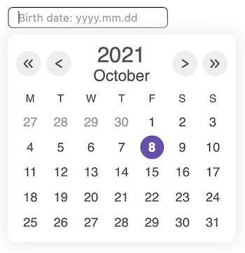


### locale <a id="locale" />

The property that holds an object with localization related properties. Have a look at their description and usage examples below.

**Type**: `object`

**Optional properties**:

- [dateFormat](#dateFormat);
- [startSunday](#startSunday);
- [months](#months);
- [addMonths](#addMonths);
- [showWeekDays](#showWeekDays);
- [weekDays](#weekDays);
- [addWeekDays](#addWeekDays).

#### dateFormat <a id="dateFormat" />

Date mask that is used to display the date and format the value returned by the component. It must contain 3 parts: `dd` for day (leading zero format), `mm` for month (leading zero format) and `yyyy` for year.  
Valid separators: `/`, `.` or `-`.

**Type**: `"string"`

**Default value**: `"dd/mm/yyyy"`

**Examples**:

```js
// valid
{ dateFormat: 'mm-dd-yyyy' };
{ dateFormat: 'yyyy.mm.dd'};

// invalid
{ dateFormat: 'mm/dd.yyyy' };
{ dateFormat: 'mm dd yy' };
{ dateFormat: 'yyyy/dd' };
```

#### startSunday <a id="startSunday" />

Defines whether a week should start with Sunday (`true`) or Monday (`false`).

**Type**: `boolean`

**Default value**: `false`

#### months <a id="months" />

Changes the language used to display month's name.

**Type**: `string`

**Default value**: `"en"`

**Possible values**:

- `"en"` - English;
- `"ru"` - Russian;
- `"de"` - German;
- `"fr"` - French;
- `"es"` - Spanish;
- `"pt"` - Portuguese;
- `"it"` - Italian.

#### addMonths <a id="addMonths" />

This property is used when you need to specify months names for the language that is absent by default in `months` property or override the default values. Keys of the `addMonths` object are language identificators (that can be then used as `months` property value) and values - array of months names. The array should contain 12 `string` values respresenting months names from January to December.

**Type**: `object`

Property: language code

Type: `Array`

**Default value**: `null`

**Example**:

```js
{
  months: 'qn',
  addMonths: {
    // Númenórean calendar, Lord of the Rings: https://lotr.fandom.com/wiki/Calendar
    qn: [
      'Narvinyë',
      'Nénimë',
      'Súlìmë',
      'Víressë',
      'Lótessë',
      'Náríë',
      'Cermië',
      'Urimë',
      'Yavannië',
      'Narquelië',
      'Hísimë',
      'Ringarë'
    ]
  }
};
```

#### showWeekDays <a id="showWeekDays" />

Defines whether week days should be displayed (`true`) or not (`false`).

**Type**: `boolean`

**Default value**: `true`

**Example**:

```jsx
<DatePicker locale={{ showWeekDays: false }} />
```

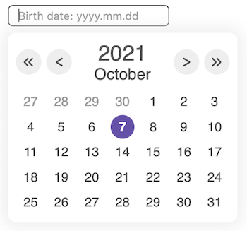

#### weekDays <a id="weekDays" />

Changes the language used to display week days abbreviations.

**Type**: `string`

**Default value**: `"en"`

**Possible values**:

- `"en"` - English;
- `"ru"` - Russian;
- `"de"` - German;
- `"fr"` - French;
- `"es"` - Spanish;
- `"pt"` - Portuguese;
- `"it"` - Italian.

#### addWeekDays <a id="addWeekDays" />

This property is used when you need to specify week days abbreviations for the language that is absent by default in `weekDays` property or override the default values. Keys of the `addWeekDays` object are language identificators (that can be then used as `weekDays` property value) and values - array of week days abbreviations. The array should contain 7 `string` values respresenting week days names from Sunday to Saturday.

> **Important**: Sunday must be the first array element with index `0`.

**Example**:

```js
{
  weekDays: 'qn', // Númenórean week days, Lord of the Rings: http://tolkiengateway.net/wiki/Elenya
  addWeekDays: {
    qn: ["V", "E", "A", "I", "A", "M", "E"]
  }
}
```


#### Example

Here is the usage of all seven `locale` properties:

```jsx
<DatePicker
  locale={{
    months: "qn",
    addMonths: {  // Númenórean calendar, Lord of the Rings: https://lotr.fandom.com/wiki/Calendar
      qn: [
        'Narvinyë',
        'Nénimë',
        'Súlìmë',
        'Víressë',
        'Lótessë',
        'Náríë',
        'Cermië',
        'Urimë',
        'Yavannië',
        'Narquelië',
        'Hísimë',
        'Ringarë'
      ]
    },
    dateFormat: "mm/dd/yyyy",
    startSunday: true,
    showWeekDays: true,
    weekDays: 'qn',
      addWeekDays: {
        qn: ["V", "E", "A", "I", "A", "M", "E"]
      }
  }}
  />
```

_Result for October, 2021:_

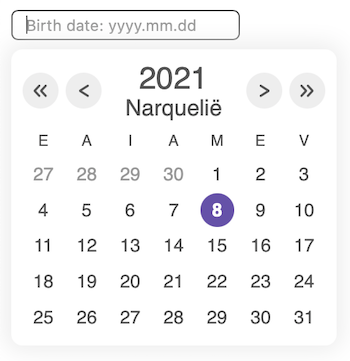


## Styling properties <a id="style-props" />

#### styleChanges <a id="styleChanges" />

The property that holds an object with all style related properties. Have a look at their description and usage examples below.

**Type**: `object`

**Optional properties**:

* [pickerContainerClass](#pickerContainerClass);
* [inputClass](#inputClass);
* [calendarContainerClass](#calendarContainerClass);
* [mainColor](#mainColor);
* [inputBgColor](#inputBgColor);
* [inputBorderColor](#inputBorderColor);
* [inputBorderFocusColor](#inputBorderFocusColor);
* [inputPlaceholderColor](#inputPlaceholderColor);
* [inputFontColor](#inputFontColor);
* [calendarContainerBgColor](#calendarContainerBgColor);
* [calendarContainerShadow](#calendarContainerShadow)
* [arrowBtnContainerClass](#arrowBtnContainerClass);
* [arrowBtnBgColor](#arrowBtnBgColor);
* [arrowColor](#arrowColor);
* [yearFontColor](#yearFontColor);
* [monthFontColor](#monthFontColor);
* [weekDaysFontColor](#weekDaysFontColor);
* [dateBgColor](#dateBgColor);
* [clickedDateFontColor](#clickedDateFontColor);
* [selectedDateFontColor](#selectedDateFontColor);
* [selectedDateBgColor](#selectedDateBgColor);
* [currMonthDateFontColor](#currMonthDateFontColor);
* [prevNextMonthsDateFontColor](#prevNextMonthsDateFontColor);
* [yearBackArrow](#yearBackArrow);
* [yearNextArrow](#yearNextArrow);
* [monthBackArrow](#monthBackArrow);
* [monthNextArrow](#monthNextArrow).

#### pickerContainerClass <a id="pickerContainerClass" />

`DatePicker`'s container class. There you may want to specify `margin` and `padding` properties for the element or any other container properties you'd like. As a value gets a class name string or a CSS module object.

**Type**: `string`, `object`

**Default value**:  class `.picker`

```css
.picker {
  position: relative;
}
```

**Example**:

```css
/* picker.module.css */

.newPickerContainer {
  background-color: #0ff; /* #0ff is aqua */
  margin: 20px;
  padding: 30px 20px;
  position: relative;
  width: fit-content;
}
```

```jsx
import React form 'react';
import styles from './picker.module.css'
import DatePicker from 'react-just-datepicker';

function DateContainer() {
  return (
    <div>
      <DatePicker />
      <DatePicker
        styleChanges={{ pickerContainerClass: styles.newPickerContainer }}
      />
    </div>
  )
}
```

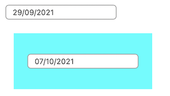

#### inputClass <a id="inputClass" />

All the styling you need to apply to the date input element should be passed here as a class name string or a CSS module object.

**Type**: `string`, `object`

**Default value**: class `.pickerInput`

```css
.pickerInput {
  border: 1px solid var(--pale-color); /* --pale-color: #999 */
  border-radius: 0.3rem;
  background-color: var(--white-color); /* --white-color: #fff */
  color: var(--main-color); /* --main-color: #555 */
  display: block;
  outline: none;
  padding: 0.2rem 0.6rem;
}

.pickerInput:focus {
  border-color: var(--main-color);
}

.pickerInput::placeholder {
  color: var(--pale-color);
}
```

 **Example**:

```css
/* picker.module.css */

.pickerNewStyle {
  border: 2px solid #f00; /* #f00 is red*/
  background-color: #0ff; /* #0ff is aqua */
  color: #00f; /* #00f is blue */
  display: block;
  font-weight: bold;
  height: 2rem;
}

.pickerNewStyle:focus {
  border-color: #0f0; /* #0f0 is green */
}

.pickerNewStyle::placeholder {
  color: #ddd; /* #ddd is gray */
}
```

```jsx
import React form 'react';
import styles from './picker.module.css'
import DatePicker from 'react-just-datepicker';

function DateContainer() {
  return (
    <div>
      <DatePicker
        styleChanges={{ inputClass: styles.pickerNewStyle }}
      />
      <DatePicker
        styleChanges={{ inputClass: styles.pickerNewStyle }}
      />
    </div>
  )
}
```

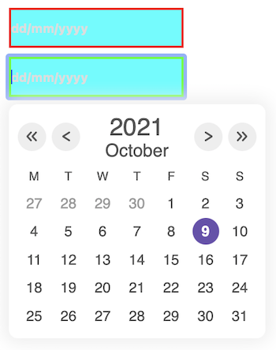

#### calendarContainerClass <a id="calendarContainerClass" />

Calendar widget container class. In most cases you would prefer using other styling properties described below like `calendarContainerBgColor` or `calendarContainerShadow`. However, if you need to apply another box shadow styling or position the calendar in other way this property will help you reach the goal.

**Type**: `string`, `object`

**Default value**: class `.calendarContainer`

```css
.calendarContainer {
  background-color: var(--white-color); /* --white-color: #fff */
  border-radius: 0.5em;
  box-shadow: 0 0 1em 0.3em var(--light-grey); /* --light-grey: #eee */
  display: flex;
  flex-direction: column;
  flex-wrap: nowrap;
  float: left;
  height: fit-content;
  width: fit-content;
  margin: 0.4em 0;
  padding: 0.5em;
  position: absolute;
  z-index: 1;
}
```

**Example**:

```css
/* picker.module.css */

.newCalendarContainer {
  background-color: #d0f0c0; /* #d0f0c0 is light green */
  display: flex;
  flex-direction: column;
  flex-wrap: nowrap;
  float: left;
  height: fit-content;
  width: fit-content;
  margin: 0 4em;
  padding: 1em;
  position: absolute;
  z-index: 1;
}
```

```jsx
import React form 'react';
import styles from './picker.module.css'
import DatePicker from 'react-just-datepicker';

function DateContainer() {
  return (
      <DatePicker
        styleChanges={{ calendarContainerClass: styles.newCalendarContainer }}
      />
  )
}
```


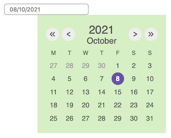

#### mainColor <a id="mainColor" />

By default, the color for displaying input border color on focus, input text, year, month, week days, button arrows and current month days is the same: `#555`. You can use `mainColor` property to change font color for all these elements at once. If you need a different color for some elements, you can use the corresponding property from the described below to change it.

**Type**: `string`

**Default value**: `#555`

**Example**:

```jsx
<DatePicker styleChanges={{ mainColor: 'green'}} />
```

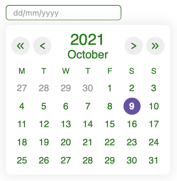

#### inputBgColor <a id="inputBgColor" />

Background color of the input element.

**Type**: `string`

**Default value**: `#fff`

**Example**:

```jsx
<DatePicker styleChanges={{ inputBgColor: 'aqua' }} />
```

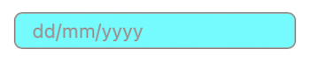

#### inputBorderColor <a id="inputBorderColor" />

Border color of the input element.

**Type**: `string`

**Default value**: `#999`

**Example**:

```jsx
<DatePicker styleChanges={{ inputBorderColor: 'aqua' }} />
```

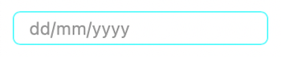

#### inputBorderFocusColor <a id="inputBorderFocusColor" />

Border color on focus of the input element.

**Type**: `string`

**Default value**: `#555`

**Example**:

```jsx
<DatePicker styleChanges={{ inputBorderFocusColor: 'blueviolet' }} />
```

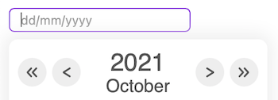

#### inputPlaceholderColor <a id="inputPlaceholderColor" />

Placeholder color of the input element.

**Type**: `string`

**Default value**: `#999`

**Example**:

```jsx
<DatePicker styleChanges={{ inputPlaceholderColor: '#a0f' }} />
```

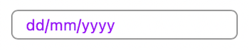

#### inputFontColor{#inputFontColor} <a id="inputFontColor" />

Input element's text color.

**Type**: `string`

**Default value**: `#555`

**Example**:

```jsx
<DatePicker styleChanges={{ inputFontColor: 'brown' }} />
```

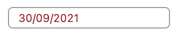

#### calendarContainerBgColor <a id="calendarContainerBgColor" />

Background color of the calendar widget.

**Type**: `string`

**Default value**: `#fff`

**Example**:

```jsx
<DatePicker styleChanges={{ calendarContainerBgColor: 'khaki' }} />
```

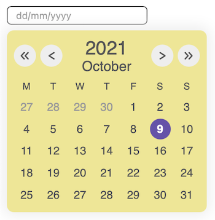

#### calendarContainerShadow <a id="calendarContainerShadow" />

Defines whether to display a shadow around calendar widget (`true`) or not (`false`).

**Type**: `boolean`

**Default value**: `true`

**Example**:

```jsx
<DatePicker styleChanges={{ calendarContainerShadow: false }} />
```

#### arrowBtnContainerClass <a id="arrowBtnContainerClass" />

This property defines styling for the following buttons: year back / forward and month back / forward. Provide a `string` for the class name or CSS module object to use your own style for these buttons. Note that in the default styling `calendarNavBtn:active path` is used to define an arrow icon color when the button is clicked.

**Type**: `string`, `object`

**Default value**: class `.calendarNavBtn`

```css
.calendarNavBtn {
  align-items: center;
  cursor: pointer;
  display: flex;
  background-color: var(--btn-main-color); /* --btn-main-color: #eee */
  border: none;
  border-radius: 100%;
  flex-direction: row;
  height: 1.6rem;
  justify-content: center;
  outline: none;
  width: 1.6rem;
}

.calendarNavBtn:focus {
  border: 1px solid var(--main-color); /* --main-color: #555 */
}

.calendarNavBtn:active {
  background-color: var(--btn-active-color); /* --btn-active-color: #999 */
}

.calendarNavBtn:active path {
  stroke: var(--arrow-color-clicked); /* --arrow-color-clicked: #fff */
}
```

**Example**:

```css
/* picker.module.css */

.newBtnStyle {
  align-items: center;
  cursor: pointer;
  display: flex;
  background-color: yellow;
  border: 1px dotted indigo;
  border-radius: 20%;
  flex-direction: row;
  height: 1rem;
  justify-content: center;
  outline: none;
  width: 1rem;
}

.newBtnStyle:focus {
  border: 1px solid black; 
}

.newBtnStyle:active {
  background-color: khaki; 
}

.newBtnStyle:active path {
  stroke: blue;
}
```

```jsx
import React form 'react';
import styles from './picker.module.css'
import DatePicker from 'react-just-datepicker';

function DateContainer() {
  return (
      <DatePicker
        styleChanges={{ arrowBtnContainerClass: styles.newBtnStyle }}
      />
  )
}
```


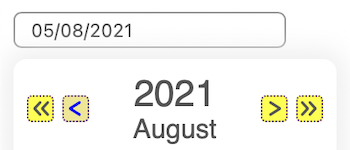

#### arrowBtnBgColor <a id="arrowBtnBgColor" />

Object property to define a background color of year back / forward and month back / forward buttons. This object should contain 2 properties: `main` and `clicked`, reflecting corresponding button state.

**Type**: `object`

**Required properties**:

* `main`

    Default value: `#eee`

* `clicked`

    Default value: `#999`

**Example**:

```jsx
<DatePicker styleChanges={{
    arrowBtnBgColor: { main: 'beige', clicked: 'blue' }
  }} />
```

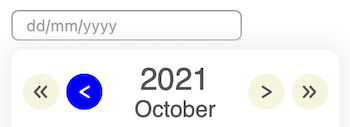

#### arrowColor <a id="arrowColor" />

Object property to define a color of the arrow icons inside buttons. This object should contain 2 properties: `main` and `clicked`, reflecting corresponding button state.

**Type**: `object`

**Required properties**:

* `main`

    Default value: `#555`

* `clicked`

    Default value: `#fff`

**Example**:

```jsx
<DatePicker styleChanges={{
    arrowColor: { main: 'green', clicked: 'fuchsia' }
  }} />
```

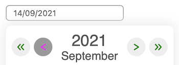

#### yearFontColor <a id="yearFontColor" />

Font color of the displayed year number.

**Type**: `string`

**Default value**: `#555`

**Example**: 

```jsx
<DatePicker styleChanges={{ yearFontColor: '#ff8c00' }} />
```

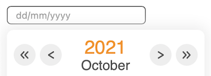

#### monthFontColor <a id="monthFontColor" />

Font color of the displayed month.

**Type**: `string`

**Default value**: `#555`

**Example**: 

```jsx
<DatePicker styleChanges={{ monthFontColor: '#ff8c00' }} />
```

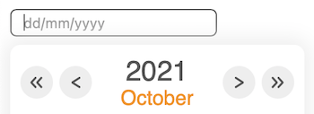

#### weekDaysFontColor <a id="weekDaysFontColor" />

Font color of the displayed week days.

**Type**: `string`

**Default value**: `#555`

**Example**: 

```jsx
<DatePicker styleChanges={{ weekDaysFontColor: '#ff8c00' }} />
```

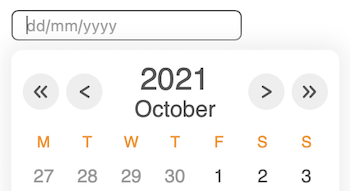

#### dateBgColor <a id="dateBgColor" />

Object property to define a background color of days element on hover and when an element is clicked. This object should contain 2 properties: `hover` and `clicked`, reflecting corresponding day element state.

**Type**: `object`

**Required properties**:

* `hover`

    Default value: `#eee`

* `clicked`

    Default value: `#7a65be`

**Example**:

```jsx
<DatePicker styleChanges={{
    dateBgColor: { hover: 'aqua', clicked: 'cadetblue' }
  }} />
```

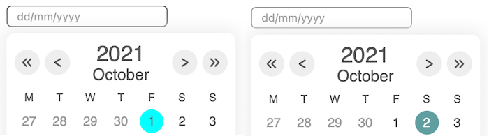

#### clickedDateFontColor <a id="clickedDateFontColor" />

Font color of the date number when the element is clicked (at that moment day element background color is defined with `dateBgColor.clicked` property).

**Type**: `string`

**Default value**: `#fff`

**Example**:

```jsx
<DatePicker styleChanges={{ clickedDateFontColor: 'red' }} />
```

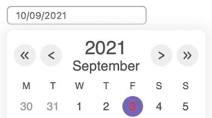

#### selectedDateFontColor <a id="selectedDateFontColor" />

Font color of the selected date.

**Type**: `string`

**Default value**: `#fff`

**Example**:

```jsx
<DatePicker styleChanges={{ selectedDateFontColor: 'yellow' }} />
```

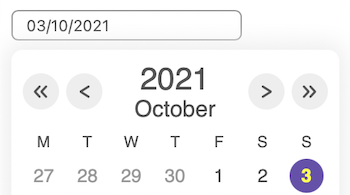

#### selectedDateBgColor <a id="selectedDateBgColor" />

Background color of the selected date.

**Type**: `string`

**Default value**: `#6951ae`

**Example**:

```jsx
<DatePicker styleChanges={{ selectedDateBgColor: 'green' }} />
```

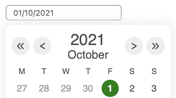

#### currMonthDateFontColor <a id="currMonthDateFontColor" />

Font color of current month's dates.

**Type**: `string`

**Default value**: `#555`

**Example**:

```jsx
<DatePicker styleChanges={{ currMonthDateFontColor: 'blue' }} />
```


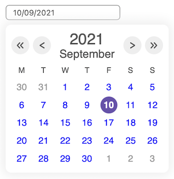

#### prevNextMonthsDateFontColor <a id="prevNextMonthsDateFontColor" />

Font color of previous and next months' dates.

**Type**: `string`

**Default value**: `#999`

**Example**:

```jsx
<DatePicker styleChanges={{ prevNextMonthsDateFontColor: 'orange' }} />
```

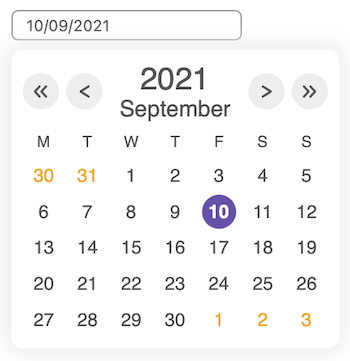

#### yearBackArrow <a id="yearBackArrow" />

The arrow icon inside the year back button. It can be any image, by default it's the .svg image that could be styled via CSS.

**Type**: `object`

**Default value**: `<svg />`

**Example**: 

```jsx
import React form 'react';
import newIcon from './img/yearBack.svg'
import DatePicker from 'react-just-datepicker';

function DateContainer() {
  return <DatePicker styleChanges={{ yearBackArrow: newIcon }} />
}
```

#### yearNextArrow <a id="yearNextArrow" />

The arrow icon inside the year forward button. It can be any image, by default it's the .svg image that could be styled via CSS.

**Type**: `object`

**Default value**: `<svg />`

**Example**: 

```jsx
import React form 'react';
import newIcon from './img/yearNext.svg'
import DatePicker from 'react-just-datepicker';

function DateContainer() {
  return <DatePicker styleChanges={{ yearNextArrow: newIcon }} />
}
```

#### monthBackArrow <a id="monthBackArrow" />

The arrow icon inside the month back button. It can be any image, by default it's the .svg image that could be styled via CSS.

**Type**: `object`

**Default value**: `<svg />`

**Example**: 

```jsx
import React form 'react';
import newIcon from './img/monthBack.svg'
import DatePicker from 'react-just-datepicker';

function DateContainer() {
  return <DatePicker styleChanges={{ monthBackArrow: newIcon }} />
}
```

#### monthNextArrow <a id="monthNextArrow" />

The arrow icon inside the month forward button. It can be any image, by default it's the .svg image that could be styled via CSS.

**Type**: `object`

**Default value**: `<svg />`

**Example**: 

```jsx
import React form 'react';
import newIcon from './img/monthNext.svg'
import DatePicker from 'react-just-datepicker';

function DateContainer() {
  return <DatePicker styleChanges={{ monthNextArrow: newIcon }} />
}
```
